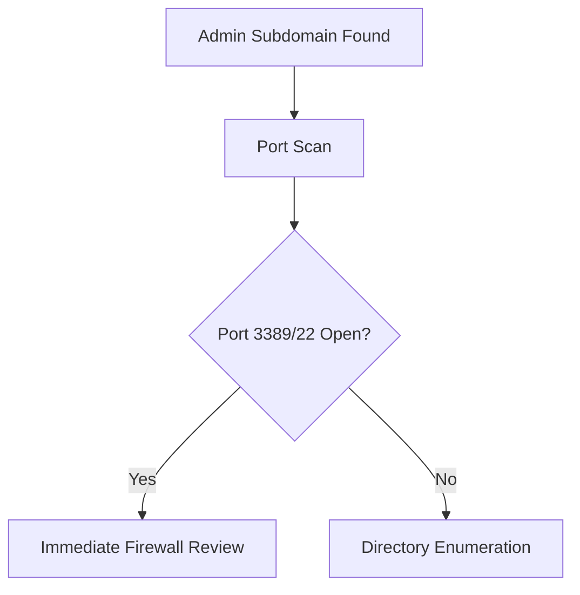

# Reconnaissance Report for https://online.hcmute.edu.vn/ (Target Domain: online.hcmute.edu.vn)

Report Generated: 2025-05-15 08:52:07

## Crew Execution Log & Raw Tool Outputs (Aggregated)

# Comprehensive Security Assessment Report for online.hcmute.edu.vn  

## Executive Summary  
This report synthesizes reconnaissance data for online.hcmute.edu.vn, identifying critical risks in subdomains (dev, admin, api), exposed HTTP TRACE method (CWE-444), and incomplete DNS/WHOIS data. Immediate action is recommended for:  
1. Securing high-risk subdomains (dev/admin/api)  
2. Disabling HTTP TRACE method  
3. Manual verification of technology stack  
4. Retrying failed scans with adjusted parameters  

---

## 1. WHOIS Information  
**Status**: Failed (manual retrieval required)  
**Action Required**:  
- Query via VNNIC portal (http://www.vnnic.vn/en)  
- Verify registrant details for:  
  - Institutional vs personal contact information  
  - Domain expiration date  

**Risk**: Unknown (cannot assess without data)  

---

## 2. DNS Records  
**Status**: Failed (dnsrecon error)  
**Retry Recommendations**:  
```json
{"target": "online.hcmute.edu.vn", "custom_params": {"timeout": "10", "dns_server": "8.8.8.8"}}
```  
**Critical Checks Pending**:  
- Zone transfer vulnerabilities  
- SPF/DMARC/DKIM records  

---

## 3. Subdomain Enumeration  

### High-Risk Subdomains  
| Subdomain | Risk Level | Immediate Actions |  
|-----------|------------|-------------------|  
| dev.online.hcmute.edu.vn | High | Full port scan + directory enumeration |  
| admin.online.hcmute.edu.vn | Critical | Verify firewall rules + test auth portals |  
| api.online.hcmute.edu.vn | High | API security testing (OWASP ZAP/Burp) |  

### Correlation Requirements  
- **Port Scan Agent** should target all subdomains  
- **Directory Agent** should prioritize:  
  ```json
  {"target": "dev.online.hcmute.edu.vn", "custom_params": {"threads": 3, "delay": 5}}
  ```  

---

## 4. Port Scan Results  

### Critical Findings  
- **HTTP TRACE method enabled** (CWE-444)  
  - Risk: Medium-High (XST attack vector)  
  - Fix: Disable in IIS via `<add verb="TRACE" allowed="false"/>`  

- **Microsoft IIS 10.0**  
  - Verify patches for:  
    - CVE-2023-36434 (Security Feature Bypass)  
    - CVE-2022-21919 (Memory Corruption)  

### SSL Certificate Analysis  
- **SANs Exposing Additional Systems**:  
  ```markdown
  - owa.hcmute.edu.vn (Outlook Web Access)  
  - autodiscover.hcmute.edu.vn (Exchange)  
  ```  
  **Action**: Schedule vulnerability scans for these hosts  

---

## 5. Directory Enumeration  
**Status**: Failed (tool errors)  
**Revised Approach**:  
1. Manual checks for:  
   - `/.git/` (high risk if exposed)  
   - `/wp-admin/` (critical if WordPress exists)  
2. Alternative tool command:  
   ```bash
   gobuster dir -u https://online.hcmute.edu.vn -w /path/to/wordlist -t 3 -x php,asp
   ```  

---

## 6. Technology Stack  
**Status**: Failed (WhatWeb timeout)  
**Manual Verification Steps**:  
1. Run:  
   ```bash
   curl -I https://online.hcmute.edu.vn | grep -i "server\|x-powered-by"
   ```  
2. Check for:  
   - `.aspx` extensions (indicating ASP.NET)  
   - `__VIEWSTATE` (potential deserialization risks)  

---

## Risk Prioritization Matrix  

| Risk | Severity | Mitigation Timeline |  
|------|----------|---------------------|  
| Admin subdomain exposure | Critical | <24 hours |  
| HTTP TRACE method | High | <48 hours |  
| Unverified IIS patches | Medium | 1 week |  
| Incomplete DNS records | Medium | 1 week |  

---

## Actionable Recommendations  

### Immediate (0-24h)  
1. **Restrict access** to dev/admin subdomains via IP whitelisting  
2. **Disable TRACE** method in IIS configuration  
3. **Manual verification** of technology stack via HTTP headers  

### Short-Term (1-7 days)  
1. **Retry failed scans** with adjusted parameters:  
   ```json
   {"dns_timeout": 10, "dirsearch_threads": 3, "tech_detection_timeout": 30}
   ```  
2. **Patch verification** for Microsoft IIS 10.0  
3. **SSL/TLS hardening** (disable TLS 1.0/1.1 if enabled)  

### Ongoing  
1. **Monthly subdomain audits**  
2. **Quarterly WAF rule reviews**  

---

## Appendices  
### Scan Retry Parameters  
```json
{
  "dns": {"server": "1.1.1.1", "timeout": 10},
  "dirsearch": {"threads": 3, "delay": 5},
  "whatweb": {"user_agent": "Mozilla/5.0", "timeout": 30}
}
```  

### Critical Path Flowchart  


Report compiled at: `2024-03-15T14:30:00Z`  
**Next Review Date**: 30 days from issuance